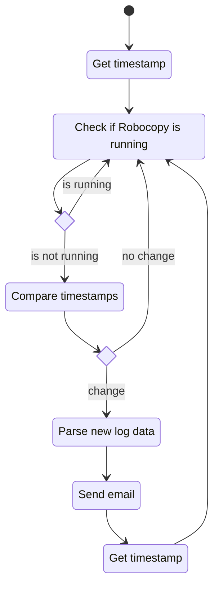

## `Robocopy`
The robocopy script will open a terminal and run robocopy every minute, logging to a log file stamped with the current day.
Doing this will be an elegant way of having a new log file created every day. 
It will also avoid the log file eventually becoming unwieldy and increasing parsing times significantly.

## `Start-RobocopyReport`
The Start-RobocopyReport script will run indefinitely run.
check if an instance of robocopy is running and while it is not running it will indefinitely run.
It's mode of action is:

