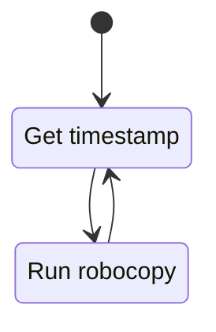
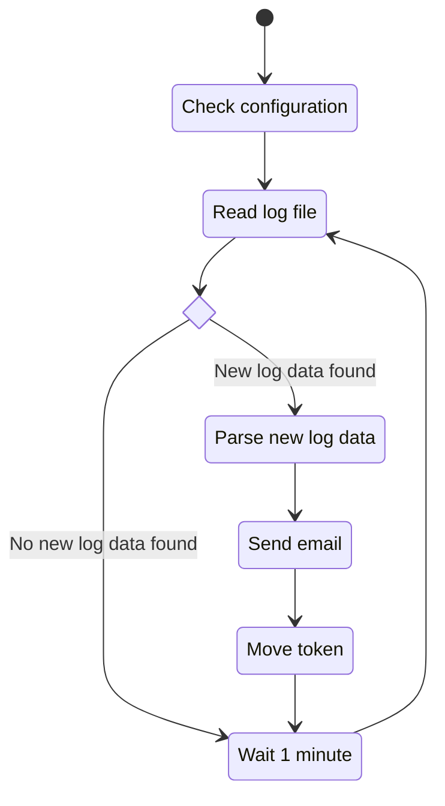

## `Start-Robocopy`
The Start-Robocopy script will open a terminal and run robocopy every minute, logging to a [log file](../example/log.txt) stamped with the current day.
Doing this will be an elegant way of having a new log file created every day. 
It will also avoid the log file eventually becoming unwieldy and increasing parsing times significantly.

## `Start-LoggingFiles`
The Start-LoggingFiles script will indefinitely run.
On startup it will check if the necessary environment configurations are there. Log file existing, event viewer having the application type for the script etc..
It will then intermittently check the log file for a token, if it does not find the token it will read the entire file and put the token at the end. If a token is found it will parse everything below it and move the token to the bottom of the file.

Here is it's normal mode of operation:
1. Parse the [log file](../example/log.txt) matching the current day and check if there is a token (E.G: `<DATA LAST READ HERE>`) in the log file.
2. If it is there then it will parse the rest of the log file starting from its position.
3. If it is not there, it will parse the entire log file and put the token at the end of the file.
4. Then it will take the parsed data and extract all the changes.
5. If there are file changes found in the parsed data it will send an email with the affected files, and log it in the event viewer.
6. If there are no changes it will simply wait 60 seconds and repeat infinitely.

