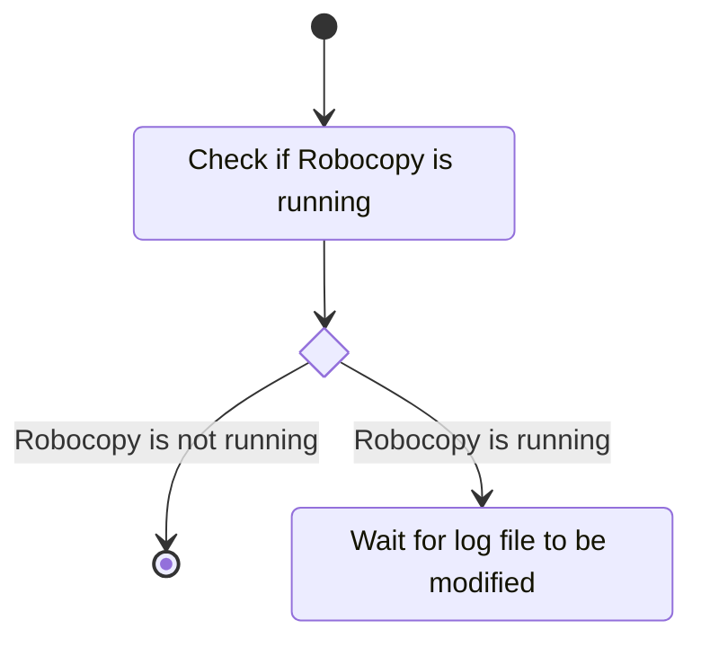

## `Robocopy`
The robocopy script will open a terminal and run robocopy indefinitely

## `Start-RobocopyReport`
The Start-RobocopyReport script will check if an instance of robocopy is running and while it is running it will indefinitely run.
It's mode of action is:

