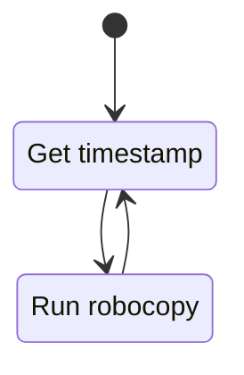

## `Robocopy`
The robocopy script will open a terminal and run robocopy every minute, logging to a [log file](../example/log.txt) stamped with the current day.
Doing this will be an elegant way of having a new log file created every day. 
It will also avoid the log file eventually becoming unwieldy and increasing parsing times significantly.

## `Start-RobocopyReport`
The Start-RobocopyReport script will indefinitely run.
On startup it will grab the timestamp from a stored file, or if it doesn't exist it will grab the current time.
It will then intermittently check if an instance of robocopy is running and when it detects robocopy is not running it will trigger its functionality.
When it triggers it will:
1. Parse the [log file](../example/log.txt) matching the current day and check if there is a started string (E.G: `Started : Sunday, 21 August 2022 3:32:32 pm`) where the date is older than the stored timestamp.
2. If it is then it will parse the rest of the log file.
3. Then it will take the parsed data and email a report.
4. Once the email has been sent it will store the ended timestamp (E.G: `Ended : Sunday, 21 August 2022 3:32:32 pm`) in memory and write it to file.

